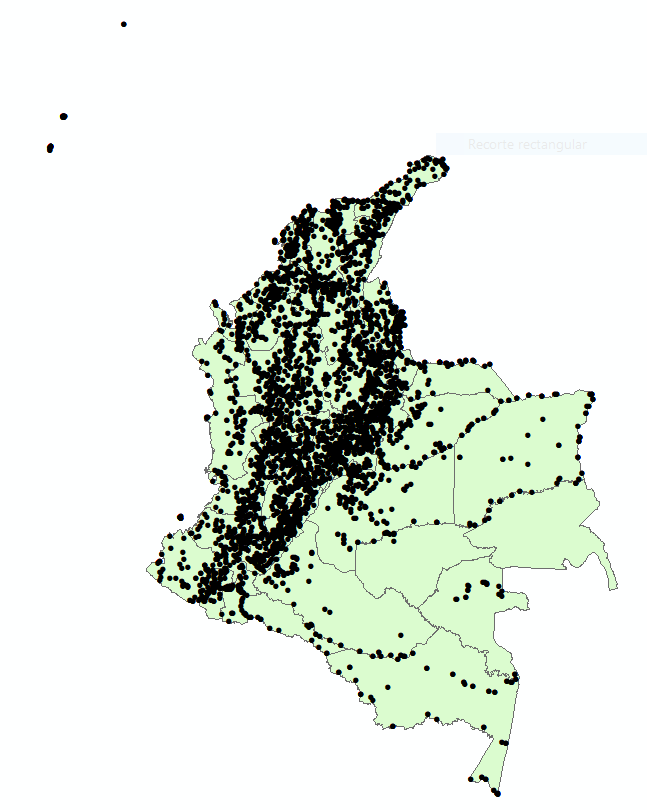
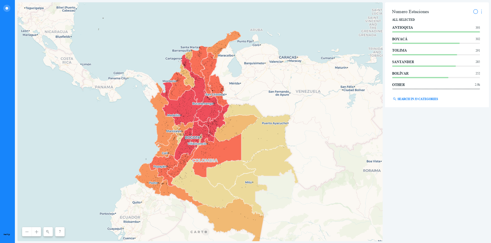

# Taller_2
Objetivo: Utilizar servicios disponibles en la nube para publicar mapas interactivos para la web.

# Publicación de cartografía vía web
Repositorio colaborativo para curso de publicación de cartografía vía web, Especialización en Geomática. 
## Investigadores:
#### Lorena Rayo Rocha `3101451`
#### Fernando Alcarcel Gutierrez `3101441`
#### Albeiro López Pulido `3101446`
---
# Departamentos de Colombia con mayor número de estaciones metereológicas instaladas.

##xxxxxxxxxxxxxxxxxxxxxxxxxxxxxxxxxxxxxxxxxxxxxxxxxxxxx
Cuál es el problema a tratar?
Por qué un mapa ayuda a resolverlo?
Descripción de los datos (tipos de geometrías, atributos, sistemas de referencia, urls para descarga de la información, etc)
Descripción del procesamiento realizado a los datos (ejm: transformaciones, filtros, geoprocesamiento, etc)
Descripción de los métodos / técnicas utilizadas para la visualización.
Se deben utilizar dos métodos diferentes para representar los datos.
Cada método debe presentarse en un mapa diferente
Descripción breve del procedimiento utilizado para publicar los mapas en la web
Ventajas / desventajas / dificultades de la publicación de mapas utilizando herramientas en la nube respecto al software desktop.
Urls públicos de los dos mapas interactivos
##xxxxxxxxxxxxxxxxxxxxxxxxxxxxxxxxxxxxxxxxxxxxxxxxxxxxx

## 1. Cuál es el problema a tratar?

Para determinar el personal necesario por departamento disponible para el mantenimiento de equipos, se requiere conocer la cantidad de estaciones  metereológicas instaladas por departamento, logrando de esta forma contratar o desplazar el peresonal necesario a cada departamento de acuerdo a su infraestructura instalada.

## 2. Por qué un mapa ayuda a resolverlo?

Teniendo una base de datos robusta con la localización espacial de cada una de las estaciones metereológicas instaladas en Colombia, se puede determinar a qué seccional de cada departamento corresponde cada estación, realizando un análisis espacial de localización con la información de departamentos de Colombia. 

 

Visualización simple de las capas utilizadas en el análisis.

## 3. Descripción de los datos (tipos de geometrías, atributos, sistemas de referencia, urls para descarga de la información, etc)

Para la realización de este trabajo se tiene dos tipos de datos, un grupo de datos tipo polígono, los cuales corresponden a la información de departamentos de Colombia, y otro grupo de datos tipo punto, el cual describe ciertas caracteristicas de las estaciones metereológicas como su fecha de instalación, su estado actual, su altura sobre el nivel del mar y su localización. los datos se tomaron de https://www.datos.gov.co/Ambiente-y-Desarrollo-Sostenible/Precipitaci-n-Media-Total-Anual-Promedio-Multianua/2bm3-399z 

Catalogo nacional de estaciones metereológicas: https://www.datos.gov.co/Ambiente-y-Desarrollo-Sostenible/Cat-logo-Nacional-de-Estaciones-del-IDEAM/hp9r-jxuu/data

## 4. Descripción del procesamiento realizado a los datos (ejm: transformaciones, filtros, geoprocesamiento, etc)

Para el desarrollo de este estudio se hicieron los siguiente procesos:

**Creación de archivo .shp:** Para el archivo de puntos se tomaron los datos crudos en tabla de excel y con la ayuda del software ArcMap se convirtieron a formato .shp de tipología de punto con todos sus atributos. 

**Descarga del archivo .shp:** Los poligonos utilizados en el estudio se descargaron directamente en formato .shp y se cargaron de forma fácil en la herramienta Carto. La descarga se realizó en el siguiente enlace https://geoportal.igac.gov.co/es/contenido/datos-abiertos-catastro

## 5. Descripción de los métodos / técnicas utilizadas para la visualización.

Para la visualización, analisis de datos y compartir los resultados de manera ágil, se seleccionaron dos herramientas: 

**Carto:** [Carto](https://carto.com/) 

Inicialmente se utilizó la herramienta [Carto](https://carto.com/) con la cual es posible no solo cargar los datos adquiridos, sino analizarlos de diferente forma con diferentes herramientas para obtener más información de la que por si tienen en sus atributos. Inicialmente se realizo un cambio de estilo al mapa, utilizando una coloración de acuerdo a su valor, lo cual permite tener una idea clara de los departamentos con mayor número de estaciones metereológicas. a dicha capa de poligonos se le relaciona una leyenda y una herramienta de selección para departamento mostrando la cantidad de estaciones instaladas en cada departamento.

## Mapa realizado en Carto:

 
Para visualizar el mapa realizado en **Carto** presione [Aquí](https://geomaticos.carto.com/builder/ba2b705a-2b36-4ff2-97d5-49de0a03bb12/embed)

**Arcgis online:** [ArcGis Online](https://www.arcgis.com/)

Se utilizó tambien la herramienta ArcGis Online, la cual permite también la visualización y analisis de datos en linea, y compartir los resultados de forma simple. allí se encuentran diferentes herramientas de analisis, sin embargo ensayamos en este caso para nuestros objetivos utilizar un "Clustering" la cual agrupa los puntos de las estaciones por densidad y muestra una leyenda de acuerdo a la cantidad de estaciones cercanas. Esta herramienta no permite visualizar de forma clara el total de estaciones en cada departamento. 

## Mapa realizado con ArcGis Online:

Para visualizar el mapa realizado en **ArcGis Online** presione [Aquí](http://arcg.is/140S9u)

## 6.Descripción breve del procedimiento utilizado para publicar los mapas en la web.

A partir del ejercicio realizado en las dos plataformas se obtuvieron las siguientes conclusiones: 

| Nombre        | Carto          | ArcGis Online  |
| ------------- |:-------------:| -----:|
|Ventajas     | Visualización más amigable, análisis rápido e intuitivo| Permite el uso de información disponible en ArcGisOnline |
| Desventajas     | No permite asignar permisos en la versión básica      |   El análisis no es tan simple, la visualización no es tan amigable|

## 6.Ventajas / desventajas / dificultades de la publicación de mapas utilizando herramientas en la nube respecto al software desktop.

Las herramientas desktop ofrecen velocidad en el manejo de grandes cantidades de datos, pero están limitadas en cuanto a trabajo colaborativo y compartir de manera facil la información se trata, mientras que las herramientas web tienen su fortaleza en la simplicidad de su manejo y en la facilidad de el trabajo colaborativo. En resumen las herramientas web en un futuro en el que logren manejar grandes cantidades de datos van a ofrecer mejores rendimientos que las herramientas desktop. Pero por el momento cada una conserva su fortaleza, por tanto no se puede precindir ya de ninguna de las dos. 

`Para referencia se adjuntan los enlaces de los mapas interactivos, los mismos que estan al pie de cada imagen `

Para Carto: https://geomaticos.carto.com/builder/ba2b705a-2b36-4ff2-97d5-49de0a03bb12/embed
Para ArcGis Online: http://arcg.is/140S9u

